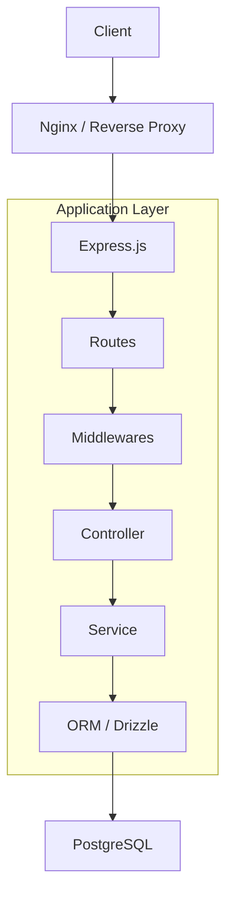

# 아키텍처 문서

## 1. 시스템 아키텍처 개요

본 프로젝트는 **계층형 아키텍처(Layered Architecture)** 를 기반으로 설계되었습니다. 각 계층은 독립적인 역할을 수행하며, 이를 통해 코드의 유지보수성과 확장성을 높입니다.

**요청 처리 흐름:**
`Client` -> `Web Server (Nginx)` -> `Application (Express.js)` -> `Routes` -> `Middlewares` -> `Controller` -> `Service` -> `ORM (Drizzle)` -> `Database (PostgreSQL)`

## 2. 모듈 및 디렉토리 구조

`src` 디렉토리의 각 모듈은 다음과 같은 역할을 담당합니다.

- **`configs`**: 환경 변수(`NODE_ENV`, `PORT`, `DATABASE_URL` 등)를 파싱하고 관리합니다.
- **`db`**: Drizzle ORM을 사용하여 데이터베이스 스키마(`schema.ts`)를 정의하고, DB 커넥션 인스턴스를 제공합니다.
- **`routes`**: Express의 `Router`를 사용하여 API 엔드포인트를 정의하고, 해당 경로의 요청을 적절한 컨트롤러 함수로 연결합니다.
- **`middlewares`**: 여러 라우트에서 공통으로 사용되는 로직을 정의합니다. (예: `authMiddleware` - 인증 처리, `errorMiddleware` - 전역 에러 처리)
- **`controllers`**: HTTP 요청(`req`)을 받아 응답(`res`)을 보내는 역할을 합니다. 요청의 유효성을 검증하고, 비즈니스 로직 처리를 서비스 계층에 위임합니다.
- **`services`**: 애플리케이션의 핵심 비즈니스 로직을 담당합니다. 데이터베이스 쿼리, 외부 API 호출 등 실제적인 작업을 수행합니다.
- **`utils`**: 공통 유틸리티 함수(비밀번호 해싱, 로거, 공통 응답 함수 등)를 제공합니다.
- **`validations`**: `zod`를 사용하여 각 API 요청의 본문(body), 쿼리(query), 파라미터(params)에 대한 유효성 검사 스키마를 정의합니다.
- **`apiSpec.ts`**: `Tspec`을 사용하여 API 명세를 타입으로 정의하고, Swagger 문서의 기반이 됩니다.

## 3. 주요 의존성

- **`express`**: Node.js 웹 프레임워크
- **`typescript`**: 정적 타입 지원
- **`drizzle-orm` / `drizzle-kit`**: SQL-like 타입 안전 ORM 및 마이그레이션 도구
- **`pg`**: PostgreSQL 드라이버
- **`zod`**: 유효성 검사 라이브러리
- **`jsonwebtoken`**: JWT 생성 및 검증
- **`bcryptjs`**: 비밀번호 해싱
- **`pm2`**: Node.js 프로세스 매니저 (프로덕션 환경)
- **`tspec`**: TypeScript 타입 기반 OpenAPI(Swagger) 문서 자동 생성
- **`vitest` / `supertest`**: 단위/통합 테스트 도구
