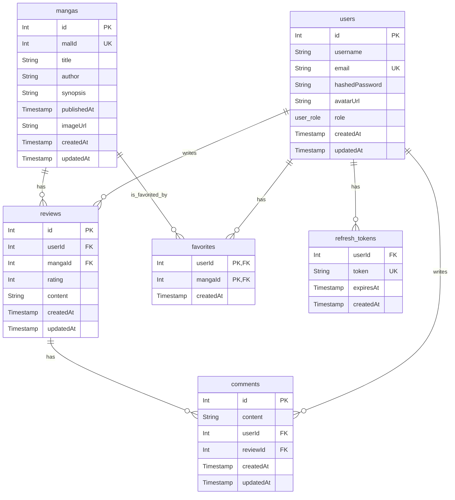

# 데이터베이스 스키마

## 1. ERD (Entity-Relationship Diagram)

## 2. 테이블 상세 정의

### `users` 테이블

| 컬럼명           | 데이터 타입        | 제약 조건                    | 설명                              |
| :--------------- | :----------------- | :--------------------------- | :-------------------------------- |
| `id`             | `serial`           | **PK**                       | 사용자 고유 ID                    |
| `username`       | `varchar(256)`     | `UNIQUE`                     | 사용자 이름                       |
| `email`          | `varchar(256)`     | `NOT NULL`, `UNIQUE`         | 사용자 이메일 (로그인 시 사용)    |
| `hashedPassword` | `text`             | `NULL` 허용                  | 해싱된 비밀번호                   |
| `avatarUrl`      | `varchar(512)`     | `NULL` 허용                  | 프로필 이미지 URL                 |
| `role`           | `user_role` (Enum) | `NOT NULL`, `DEFAULT 'user'` | 사용자 역할 ('user' 또는 'admin') |
| `createdAt`      | `timestamp`        | `NOT NULL`, `DEFAULT now()`  | 생성 시각                         |
| `updatedAt`      | `timestamp`        | `NOT NULL`, `DEFAULT now()`  | 마지막 수정 시각                  |

### `mangas` 테이블

| 컬럼명        | 데이터 타입    | 제약 조건                   | 설명             |
| :------------ | :------------- | :-------------------------- | :--------------- |
| `id`          | `serial`       | **PK**                      | 만화 고유 ID     |
| `malId`       | `integer`      | `NOT NULL`, `UNIQUE`        | MyAnimeList ID   |
| `title`       | `varchar(256)` | `NOT NULL`                  | 만화 제목        |
| `author`      | `varchar(256)` | `NULL` 허용                 | 작가             |
| `synopsis`    | `text`         | `NULL` 허용                 | 줄거리           |
| `publishedAt` | `timestamp`    | `NOT NULL`                  | 출판일           |
| `imageUrl`    | `varchar(512)` | `NULL` 허용                 | 표지 이미지 URL  |
| `createdAt`   | `timestamp`    | `NOT NULL`, `DEFAULT now()` | 생성 시각        |
| `updatedAt`   | `timestamp`    | `NOT NULL`, `DEFAULT now()` | 마지막 수정 시각 |

### `reviews` 테이블

| 컬럼명      | 데이터 타입 | 제약 조건                     | 설명             |
| :---------- | :---------- | :---------------------------- | :--------------- |
| `id`        | `serial`    | **PK**                        | 리뷰 고유 ID     |
| `userId`    | `integer`   | `NOT NULL`, `FK to users.id`  | 작성자 ID        |
| `mangaId`   | `integer`   | `NOT NULL`, `FK to mangas.id` | 만화 ID          |
| `rating`    | `integer`   | `NOT NULL`, `CHECK (1-5)`     | 평점 (1~5)       |
| `content`   | `text`      | `NOT NULL`                    | 리뷰 내용        |
| `createdAt` | `timestamp` | `NOT NULL`, `DEFAULT now()`   | 생성 시각        |
| `updatedAt` | `timestamp` | `NOT NULL`, `DEFAULT now()`   | 마지막 수정 시각 |

### `comments` 테이블

| 컬럼명      | 데이터 타입 | 제약 조건                      | 설명             |
| :---------- | :---------- | :----------------------------- | :--------------- |
| `id`        | `serial`    | **PK**                         | 댓글 고유 ID     |
| `userId`    | `integer`   | `NOT NULL`, `FK to users.id`   | 작성자 ID        |
| `reviewId`  | `integer`   | `NOT NULL`, `FK to reviews.id` | 리뷰 ID          |
| `content`   | `text`      | `NOT NULL`                     | 댓글 내용        |
| `createdAt` | `timestamp` | `NOT NULL`, `DEFAULT now()`    | 생성 시각        |
| `updatedAt` | `timestamp` | `NOT NULL`, `DEFAULT now()`    | 마지막 수정 시각 |

### `favorites` 테이블

| 컬럼명      | 데이터 타입 | 제약 조건                             | 설명               |
| :---------- | :---------- | :------------------------------------ | :----------------- |
| `userId`    | `integer`   | **PK**, `NOT NULL`, `FK to users.id`  | 사용자 ID          |
| `mangaId`   | `integer`   | **PK**, `NOT NULL`, `FK to mangas.id` | 만화 ID            |
| `createdAt` | `timestamp` | `NOT NULL`, `DEFAULT now()`           | 즐겨찾기 추가 시각 |

### `refresh_tokens` 테이블

| 컬럼명      | 데이터 타입 | 제약 조건                    | 설명                 |
| :---------- | :---------- | :--------------------------- | :------------------- |
| `userId`    | `integer`   | `NOT NULL`, `FK to users.id` | 사용자 ID            |
| `token`     | `text`      | `NOT NULL`, `UNIQUE`         | Refresh Token 문자열 |
| `expiresAt` | `timestamp` | `NOT NULL`                   | 토큰 만료 시각       |
| `createdAt` | `timestamp` | `NOT NULL`, `DEFAULT now()`  | 토큰 생성 시각       |
